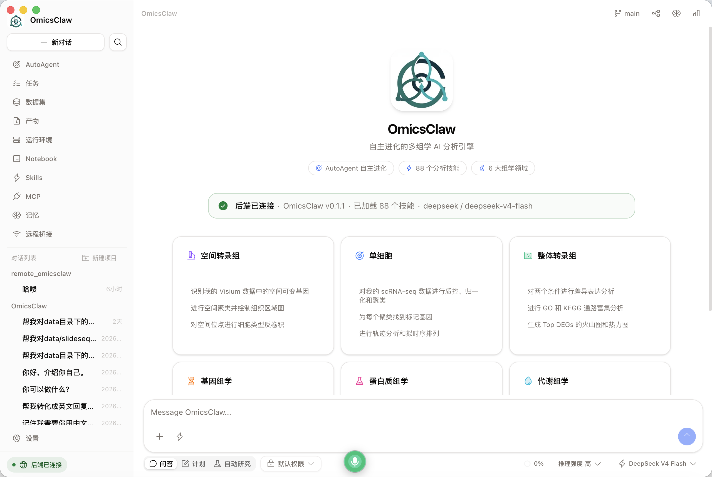

<a id="top"></a>

<div align="center">

<a href="https://github.com/TianGzlab/OmicsClaw">
  
</a>

<h3>Local-first AI research partner for multi-omics analysis</h3>

<p>Chat with your workflows · run reproducible skills · keep data local · resume with memory</p>

<p>
  <b>English</b> ·
  <a href="README_zh-CN.md"><b>简体中文</b></a> ·
  <a href="#-whats-new"><b>What's New</b></a> ·
  <a href="#-quick-start"><b>Quick Start</b></a> ·
  <a href="#npm-desktop"><b>npm + Desktop</b></a> ·
  <a href="#-domains"><b>Domains</b></a> ·
  <a href="https://TianGzlab.github.io/OmicsClaw/"><b>Docs Site</b></a>
</p>

[](https://www.python.org/downloads/)
[](https://opensource.org/licenses/Apache-2.0)
[](https://github.com/psf/black)
[](https://github.com/TianGzlab/OmicsClaw/actions/workflows/pr-ci.yml)
[](https://TianGzlab.github.io/OmicsClaw/)
[](https://github.com/TianGzlab/OmicsClaw/releases/latest)
[](https://github.com/TianGzlab/OmicsClaw/releases)
[](https://github.com/TianGzlab/OmicsClaw/releases/latest)

</div>

> **OmicsClaw turns local multi-omics tools into AI-callable skills.** The LLM plans and operates; Python, R, and CLI tools process your data in a local or remote runtime — raw matrices never leave your machine. One agent loop serves the terminal, the desktop app, and chat platforms.

## 📢 What's New

- **🧹 The old stack is out: eleven packages removed, ~128k lines, in four reviewable commits** — the rebuild's last open item was the migration, and it has now run. `skill/`, `providers/`, `control/`, `services/`, `autonomous/`, `execution/` and `loaders/` went first because each has a shipped successor (`skills/`, `provider/`, `entry/`, `tools/_workspace.py`, `sandbox/`); then `agents/`, `knowledge/`, `extensions/`, `analysis_router/` and `research/`, which do **not** — removing those drops the capability rather than re-homing it, and that was an explicit owner ruling rather than a cleanup. **Five packages are deliberately kept and do not import**: `autoagent/` (19k lines, whose core idea is to be carried into the rebuilt framework in its own work), `runtime/consensus` + `workflow`, `routing/`, `surfaces/` and `diagnostics.py`. They reach `omicsclaw.skill` or `omicsclaw.providers` and are read-only reference now; `AGENTS.md` says so per package, because "kept" and "works" are different claims and the tree no longer lets you tell them apart by looking. **`common/` and `core/` are not legacy and were never candidates** — they are the science layer 96 skill scripts import (`omicsclaw.common.report` alone has 91 call sites), and the only thing that made them look like old-stack packages is that they are old. **The skill runner is gone by decision.** `oc run <skill> --demo` had already stopped working before this work began — the entry point moved to `omicsclaw.launch:main` and the 35-subcommand CLI it came from needs the deleted `omicsclaw/skill/`, so it could not be restored in place either. The ruling is to leave it out: skills are reached by the agent, which reads a `SKILL.md` and runs the script with `bash`. What that costs is the deterministic half — the `result.json` envelope check, the run receipt, the replay capsule — and it is written down rather than implied. **Two documentation defects worth more than the deletions.** `CLAUDE.md`'s CLI Reference held 15 spatial commands whose paths were wrong *before* the rebuild (`skills/spatial-preprocess/…` where the tree has `skills/spatial/spatial-preprocess/…`), and its routing table said 13 bulkrna skills against 14 on disk — an error that survived because the total, 96, was right either way. Both are corrected against `find skills -name SKILL.md`. **22 skills still write a `replot` hint into their `result.json` pointing at a command that no longer exists**, which is a live falsehood in product output rather than in a document; it is named in `CLAUDE.md` and open. Each commit was gated on the rebuilt stack's own suite — **4,412 passed, 10 skipped** — and the one new-stack test the removals broke was repaired rather than deleted: `tests/tools/test_workspace.py` loaded the legacy path validator from disk to diff against it, and now carries a frozen verbatim copy of its `validate_path`, verified identical over the whole corpus at capture time, so the comparison stays live for a corpus entry added later.
- **🔭 Step 6.11 of the framework rebuild: the Observability module** — `omicsclaw/observability/` is the layer that answers *is it working, what does it cost, what is slow* about a running agent: one OpenTelemetry-shaped trace per exchange (`interaction → turn → llm_request | tool`), six instruments (LLM duration, input and output tokens, tool calls, tool duration, turns), and a `Telemetry` object the composition root asks for once and then never branches on. **No seam was cut into the engine**, which is the whole design: harness9 has to add a four-method `EngineObserver` interface to `internal/engine` because a Go loop can only be watched by being called back, while this rebuild's loop already publishes those moments as `EngineEvent` — so the observer *consumes* an existing stream, `omicsclaw/engine/` is unchanged, and the layer whose own docstring says "no I/O, no logging" keeps that property after a telemetry layer exists. **OpenTelemetry is an optional dependency and the contract is ours**: `Span` / `Tracer` / `Meter` are declared in the standard library, `otel.py` is the only module that knows the SDK exists and imports it inside a function, and a stdlib `stdout` backend means a contributor sees the trace tree of a run — and the test suite exercises a real backend — with nothing installed. **Payloads do not leave the machine unless somebody says so**, and this is the deliberate departure from the reference, which always serializes the conversation, the tool arguments and the tool output into span attributes: an OmicsClaw prompt routinely names a cohort, a sequencing run or a patient sample, and `CLAUDE.md`'s first safety rule is that genetic data never leaves this machine — so `OMICSCLAW_OTEL_CAPTURE_CONTENT` is off by default, every `langfuse.*` attribute is gated on it, and what a dashboard needs (structure, model, tokens, durations, outcomes, every metric) is recorded either way. **A turn span is created lazily**, because the loop emits `TURN_END` and has no `TURN_START`: the only honest moment to open turn *N+1* is the instant turn *N* ended, when nobody yet knows whether the run continues, so the scope holds the *intent* and materialises it when the model call asks for a parent — a finished run discards an intent instead of exporting an empty phantom span. **Three defects the work found on itself**, each caught by a test written before the fix: a backend that went away mid-run let an exception escape `current_parent()` into the model call and killed the exchange (telemetry may cost a span, never a run); the blocking path — `AgentEngine.run` drops its events by design — put *every* model call of a multi-turn run inside one span labelled `agent.turn=1`, which is not a missing level but a wrong number, now fixed by an explicit `turn_events=False` that warns when a caller forgets it; and `ObservabilityConfig(exporter="stdout")` built a silently inactive deployment because `StrEnum` compares equal under `==` but not under the `is` this package uses. The tracing hook mounts **last** in the chain where `AuditHook` mounts **first** — audit wants to *hear about* a refusal, tracing wants to *not measure* one — and the two share one vocabulary for how a call ended (`AuditOutcome`, four values where the reference has two, so a refused call and a crashed tool are not one bucket). With nothing configured the provider is handed back unwrapped and no hook is mounted, so an unobserved deployment's object graph is what it was before this package existed. **Two independent read-only evaluations gated the step and neither found what the other did.** The correctness one found a defect *class*: two seams started a span and *then* decorated it inside one `try`, so a decoration that raised left a created span with nobody holding a reference to end it — one trace gone, silently; both now pass every attribute to `start_span`. It also showed the `__aexit__` flush argument, the one citing `hooks/chain.py`'s cancellation defect by name, was pinned by **no test at all** — moving the `await` inside the `try` left 260 tests green — and that the per-call ContextVar had overwrite semantics where its neighbour has stack semantics. The parity one overturned this layer's own claim that harness9 treats a failed `Setup` as fatal: `cmd/harness9/main.go:127-131` logs and degrades, and the reference is fail-open end to end — the conclusion was right and the argument for it was invented, which is the defect. It also found one genuinely missing feature nobody had recorded (a global handler for *runtime* export failures, so an expired key stops the traces with a clean local log) and a citation off by ~17 lines pointing at the wrong function; five citations were re-verified and corrected, one of which this step's own edit had rotted. Every finding was repaired and pinned. **274 tests** (257 in the layer, 17 on the wiring). See [plan 0043](docs/plans/0043-observability-layer.md).
- **⌨️ `oc cli` caught up with the engine underneath it: `/compact`, `/resume`, `/plan`, `/tasks`, `!cmd`** — a line-by-line comparison against the Go reference's CLI and TUI found that the gap was almost never a *missing capability*; it was a capability already running with no command in front of it. Compaction has been in the loop since step 6.6 and `SessionRegistry.compact()` has existed since — but no one could trigger it. Conversations have been persisted in `<workspace>/.omicsclaw/memory.db` since the memory wiring landed, while `/sessions` still printed "Sessions are in-memory only in this build", a sentence that had become **false in the default deployment** and that nobody had gone back to correct. Plans have been written to `.omicsclaw/plans/` on every `plan_write` since step 6.9, and the terminal could only ever see `<- plan_write ok`. **The pattern is the finding**: a decision recorded as "blocked, wait for its own step" has nothing that notifies it when that step ships, so the reason expires and the code does not move. So: `/compact` summarizes now and reports what it saved, refusing while an exchange is running in the same conversation; `/sessions` lists what the database holds and says which of the two deployments this is; `/resume <id|number>` continues one, and the history is appended to what was stored rather than to a fresh blank; `/plan` and `/tasks` print the agent's task list with its statuses. **`/plan` and `/tasks` are read-only by decision, not by staging** — the agent decides when a job is worth planning, matching the reference, which removed exactly such a mode, so there is no `/approve-plan`, no `/resume-task`, and no seam reserved for them. **`!cmd` runs a shell command in the workspace** without a model call and without an approval prompt — a person typing `!rm -rf build` already has a shell on this machine, so confirming their own command is theatre — and its output is shown to the model with the *next* question and then cleared. Two things there are deliberately **not** copied from the reference: it reuses its own 30-second tool ceiling, where this one is a separate 60 seconds because `tool_timeout_s` is minutes long for an alignment nobody is watching and this is a person staring at a cursor; and its thirteen-name list of interactive programs is kept **only as a courtesy message**, because it reads the first word only and `echo hi && vim` walks past it. The guarantee is the timeout plus a killed process group, and the test for it uses a `cat` on a FIFO — a name deliberately *not* on the list — to prove the cost of a miss is N seconds rather than a wedged session. Approval cards gained a middle grant, `s`, that stops asking for the rest of the conversation and writes nothing to disk, which is the option most people actually want between "once" and "forever". One thing the reference does was **rejected rather than ported**: it keeps its session database in `$HOME`, so `/resume` mixes every project on the machine into one list, and its own `main.go` splits one session's state across two granularities. Here the database is per workspace, `SqliteSessionStore.list` filters nothing on purpose — the file *is* the boundary — and that is now written in its docstring and pinned by a test, so whoever later shares one database across a multi-user surface meets the constraint before the leak. **26 new tests, 13 mutations each killing a named test** — the thirteenth came from an independent review, which found that the twelve left one hole: replacing `os.killpg` with a kill of `bash` alone passed every shell test, because the hang those tests provoke (`cat` on a FIFO) is a shell that `exec`s and so has no children to orphan. What that mutation describes is a timeout reporting a bounded command while a background job it started keeps writing to the workspace, so the new test makes a survivor **a file that should not exist** rather than a live pid — an orphan killed but not yet reaped is a zombie, and a zombie answers `os.kill(pid, 0)` as though it were alive. Plus a real `oc cli` process fed all five commands. See [plan 0041](docs/plans/0041-cli-parity-with-harness9.md).
- **🪝 Step 6.10 of the framework rebuild: the Hooks module** — `omicsclaw/hooks/` is the extension point the tree did not have: everything that happens around a tool call today was written by the step that needed it, and a deployment, a sub-agent or a future step wanting to interpose anything had nowhere to put it. Plan 0031 deferred the idea by name ("hooks：permission / danger / offload / observability | 不做（Q13）") while `entry/assembly.py` reserved the doorway. **The scope was decided by an inventory rather than by the reference**: harness9's `internal/hooks` bundles one mechanism with four policies, and three of those four already have homes here — permission and the danger patterns are `omicsclaw/permission/`, oversized output is `omicsclaw/context/`'s `Offloader`, plan persistence is `omicsclaw/planning/` — so this step builds the mechanism and the one hook nobody owned. **A hook decorates a tool, not the registry**, continuing plan 0038's decision for the same reason: the engine probes the registry with `isinstance` for two optional Protocols and a wrapper that forgets to forward one does not fail, it silently charges a human's approval time to the tool's timeout. **The decision vocabulary is two words, not three** — `allow` and `deny`, no `ask` — and the argument is mechanical rather than stylistic: the chain runs *inside* the permission gate, `GatedTool._run_settled` publishes an `AUTO` policy before the tool runs, and `require_approval` reads that first, so a question put from inside the chain would answer itself. That *is* the reference's `explicitlyAllowedContextKey`, reached through a mechanism that already existed instead of two new context keys, and it keeps "why was I asked?" to one answer. **The interface has three methods where the reference has two**, because Go's inner `Execute` returns an `IsError` result while Python's tool raises — flattening an exception into a string to fit one signature throws away the type the registry builds the model's error text from — and the third buys a guarantee the reference's interface cannot offer: every `before_execute` that returned is paired with exactly one closing call, *including when a later hook denies*, where `hooks/hook.go:70-75` returns without closing anyone. **A hook's own failure is contained and read as `allow`**, fail-open, deliberately opposite to the gate — a broken metrics sink does not get to break a working tool, and a deployment that wants a call stopped when a check cannot run writes a permission rule. The one hook shipped is `AuditHook`: one JSON line per call to a sink the composition root supplies, no OpenTelemetry and no third timing number, and **arguments are never written down** — only a SHA-256 digest of them. **Two defects the work found on itself**, both silent: `_is_bash` unwrapped one wrapper, which was right while the gate was the only one, so mounting a chain made a sandboxed session ask for approval on every command with nothing raised; and the audit record's `detail` first carried the exception *message*, which for `read_file` is the path it could not open — so a failure now records the class name alone, a fixed vocabulary no argument can reach. `audit_log` is the only path in `AppConfig` with no default location, because a trail that appears without being asked for is a file about a person written because nobody said no; with nothing configured `hook_tools` returns the tools unwrapped and the object graph is unchanged. **Two independent read-only evaluations gated the step and the correctness one found two real defects**, both in cancellation and both reproduced before being repaired: `_notify` swallowed a *genuine* `task.cancel()` arriving while a hook was being told of a failure — after which the bare `raise` re-raised the tool's own exception, so a cancelled turn reached `ToolRegistry.execute` as an ordinary `Exception` and came back to the model as a retryable Observation, walking around the side of the very guard that forbids it; and the decision loop had no `BaseException` handler at all, so a hook cancelled *while deciding* left every hook before it with no closing call — breaking the one invariant this package advertises over the reference. The justification in the first version's docstring was itself wrong ("awaiting inside a cancelled Task raises again" — it does not), and the test that pinned it has been rewritten rather than deleted, with its docstring saying what a future failure would mean. **Every cancellation test in the file raised `CancelledError` by hand; neither defect was reachable that way**, so five now use a real `task.cancel()`. The parity evaluation separately caught a citation one line-range too narrow and an over-claim: `context`'s `Offloader` is a *narrowing* of `hooks/offload.go`, not a full cover — pressure-driven rather than per-call, and with no read/write exclusion list — which the table now says. **135 tests**, standard library only, whole rebuilt stack = **4,068 passed, 9 skipped**. See [plan 0042](docs/plans/0042-hooks-layer.md).
- **🧊 `oc cli` no longer freezes on a question that needs two approvals** — one model message can carry two calls to tools that are both *concurrency-safe* and *approval-gated*; the registry mounts exactly two such tools, `web_fetch` and `web_search`, so "read these two pages" or "search for X and Y" was enough to reach it. The REPL answers each request from its own Task — correctly, because a pump that stopped to ask a human could never deliver the *second* request — but both Tasks then prompted the **same** `prompt_toolkit` `PromptSession`, whose `Application.run_async` opens with `assert not self._is_running`. The second Task died on that assertion without settling its request, and a terminal deployment sets **no approval deadline on purpose** (`approval_timeout_s=None`, because a person is present), so the exchange waited forever for an answer that could no longer be given. What made it undiagnosable rather than merely broken: the REPL holds the log sink until it gives the terminal back, so the traceback only appeared *after* the process was killed. **The terminal is one device and now queues its readers** — `PromptToolkitSource` and `StreamSource` each hold one reader at a time (two `readline` threads on one stdin have the same defect in a quieter form: the line the person typed goes to whichever thread the kernel wakes, so the question they answered is not the one their answer settles), and a reader still queued when the source closes is refused with `EOFError` rather than left waiting. **Two cards in a row need two labels**, so the prompt now carries the card's own `#1` / `#2`. Independently of the cause, `Repl._ask` now **denies on any failure**: a question that cannot be put is still answered, because at this surface an unsettled request is not a slow exchange, it is one that never ends. The escape route was a two-exception `except` that a plain `AssertionError` walked straight past. **Why the tests were green**: `tests/entry/test_cli_repl.py`'s trap-1 case drives the concurrent path through `ScriptedSource`, and a list serves two readers happily — the same "a double wider than the protocol produces a green that proves the double" lesson the entry layer already learned once, found a second time in the same package. The new `tests/entry/test_cli_input.py` puts `prompt_toolkit`'s own assertion into the double; four mutations, each killing a named test, plus a reproduction in a real pty. Desktop and Channel are unaffected — Channel sets a deadline, and Desktop's missing `/chat/permission` is a separate gap already named below.
- **🧠 The agent remembers now: `omicsclaw/memory/` is wired into the loop** — the memory layer shipped complete and **unreachable**: nothing in the running agent constructed a database, so the long-term store, the `MEMORY.md` précis, the extractor and the SQLite session store each had zero callers. One new composition module, `omicsclaw/entry/memory.py`, closes all four seams at once. `build_app` opens `<workspace>/.omicsclaw/memory.db`; `memory_search` and `memory_write` (add / update / remove) are mounted after every other tool, each declaring its own policy so remembering never stops to ask a human; the top-rated entries are rendered into `MEMORY.md` and injected as the **last** block of the system prompt, behind a closure rather than a snapshot — `memory_write` rewrites that file *while the agent runs*, and a snapshot would show the agent the version before the one it just wrote; and every compaction now hands the messages it is about to summarize away to an extractor, so what was said survives the summary that replaces it. **Conversations survive the process too**: `attach_sessions` now defaults to the app's own database rather than to an in-memory store, so persistence is what calling it the short way gets you instead of something a surface has to know to ask for. **The design decision worth repeating is one the tests forced.** Building the extractor at assembly time — the obvious place — captures the summarizer, and `dataclasses.replace(app, summarizer=…)` is how this codebase substitutes one; four existing compaction tests went red because extraction had quietly kept calling the *provider* the app was built over. It is therefore derived in `build_compactor` from `app.memory` and `app.summarizer` in the same breath, and `AgentApp.memory_extractor` is an override rather than the switch. One place goes past the Go reference: its `memory_write` cannot set an importance back to zero (its own source says so), and here "unsaid" and "zero" are different values. One place had to be walked back. The reference returns every search hit unbounded; this one bounds the answer at 4 KB, and an **independent evaluation caught the bound answering `[]` for a memory the store had just found** — a single entry too large to fit was dropped, the model was told nothing matched, and the hit's use count had gone up all the same, so the entry stopped looking stale on the strength of a read nobody got. The best match is now never dropped: its body is shortened on a UTF-8 boundary and flagged `content_truncated`, so the answer stays bounded, stays valid JSON, and stays honest about what was cut. **45 mutations, each killing a named test**, plus an end-to-end proof that the loop is closed rather than merely wired: one compaction, then the fact appears in the *next* render of the system prompt. `--memory false` turns all of it off in one switch. See [plan 0040](docs/plans/0040-memory-wiring.md).
- **🗺️ Step 6.9 of the framework rebuild: the Planning module** — `omicsclaw/planning/` gives the agent an execution plan that lives **outside the conversation** and is put back in front of it before every model call. This closes a hole step 6.6 opened: compaction now runs before every call, which a long analysis needs — and which also summarizes away the turns where the agent said what it set out to do. A `plan_write` tool maintains the list (write mode, or read mode to get it back), and the outstanding items are re-appended to the end of each request under a header saying they outrank whatever the history now appears to say, so the plan survives a compaction **and** a restarted process. **Planning is a native capability, not a mode** — there is no switch a person flips, only a prompt section telling the model when a task is worth planning, matching the reference harness, which removed exactly such a mode. Two rules guard opposite failures: a write may mark **at most one** item `completed` without having marked it `in_progress` first — the reference built that check after a model claimed nine of eleven items done in a single call with no work behind any of them — and a `cancelled` item can never jump straight to `completed`; meanwhile items the model *omits* are kept if they were already started, because a partial update must not silently lose the task in flight. Plans are two files per session under `<workspace>/.omicsclaw/plans/` — JSON for the machine, Markdown for you — written through on every accepted change, so the crash window is one file write rather than one turn. **The engine learned nothing about plans**: it gained one optional `TurnAugmentor` seam, consulted after the compactor, able only to append to the call being made and never to the history it carries forward. Wrapping the existing compactor instead was rejected on evidence — `entry/turn.py` reads three concrete attributes off it, so a wrapper that forgets to forward them does not fail, it silently drops a run's compaction records. **Two literals were re-derived rather than ported**, and the second is the one that would have been easy to miss: the "stop and plan" threshold (the reference's 12 is 15% of *its* 80-turn budget; the same fraction of ours rounds to 8) and the **language of the injected text** — the reference's header is Chinese because its prompt is, while every section of ours is English and `SOUL.md` says to default to it, so porting it would have been a language switch nobody asked for in the one message whose whole job is to be obeyed. **Three defects the work found on itself**: `run_turn` and `stream_turn` never told tools which session they were in, so a plan was written to an anonymous slot and gone by the next call with nothing raised; a prompt example named a real skill, which leaks into deployments running `skills_index=off`; and the atomic-write test was vacuously green because it provoked its failure before a single byte was written. **Two independent read-only evaluations gated the step.** Three of their findings were repaired — a rule that refused a *resent* completion as if it were a second one, an ordering claim in a docstring that no test held to, and two of three exchange paths having no coverage — and one was **rejected on evidence**: six "regressions" that both evaluations independently traced to an unrelated, half-finished file another session had left in the same working tree. Of 25 citations to the Go reference, 7 pointed at the wrong lines; all 28 have now been re-verified line by line, because a file:line citation is a claim and an unchecked one is a defect even when the sentence around it is right. `tests/planning/` = **181 passed**, whole rebuilt stack = **3,679 passed**. See [plan 0039](docs/plans/0039-planning-layer.md).
- **🔐 Step 6.8 of the framework rebuild: Human-in-the-Loop permission control** — `omicsclaw/permission/` decides **whether** a tool call happens at all, which until now had exactly one input: the `ToolPolicy` attached to a tool *name*, so `bash` was one switch with two positions. A rule file at `<workspace>/.omicsclaw/settings.json` now says `allow`, `deny` or `ask` per tool **and argument** — `bash(git *)` runs, `bash(rm -rf *)` is refused before the tool is touched, `write_file(/etc/*)` never happens — matched against the argument the tool's own JSON Schema declares as its principal one, so a rule about a path is about a path and not about the file content. `--permission-mode` picks the session's posture: `default`, `auto-approve`, `read-only` (refuses anything not declaring `read_only=True`, which includes `bash`) or `bypass-all` for a throwaway container. 28 built-in patterns escalate a dangerous shell command to an approval prompt that says *why* — including five for data **leaving** the machine (`scp`, remote `rsync`, `ssh`, `curl` uploads), which is the rule a destination blocklist cannot enforce and which the Go reference has none of. Answering "always allow" at the CLI prompt now writes the rule and the next call stops asking. **The approval transport was not touched**: `require_approval` still fails closed, the `ApprovalBroker` still carries the question to a surface, and a human's thinking time still stays out of the per-tool timeout — which is why the gate decorates each *tool* rather than the registry, since a registry wrapper that forgets either of two `runtime_checkable` Protocols does not fail, it just silently recharges that wait. **Two independent read-only evaluations gated the step** and neither found a way to bypass the gate, prompt twice, or lose the timeout pause; six repairs came out of them, and the two worth repeating are that `Path.mkdir(parents=True, mode=…)` applies the mode to the leaf directory only — leaving intermediate ones world-traversable under a docstring promising otherwise — and that a capability with no caller is dead code however well tested, which is what "always allow" was until a surface could reach it. Three things the reference has were verified against its source and deliberately **not** ported: its dangerous-command hook is unreachable in its own default wiring, and two of its four permission modes are read nowhere. See [plan 0038](docs/plans/0038-permission-layer.md).
- **🚪 Step 6 of the framework rebuild is complete: the entry layer** — `omicsclaw/entry/` is the top layer, the one that assembles the five rebuilt layers below it and faces the user: composition root, config, sessions, turn orchestration, a typed event stream, approval — plus three surface facades, `channel/`, `desktop/` and `cli/`. (6.5, 6.6 and 6.7 above plug into this layer; it finished last.) **The three surfaces are a port, not a rewrite**, on an owner ruling that overturned the plan's own assumption and was right to: measurement showed the old surfaces are not half-dead, their seam is just very thin — the whole of `omicsclaw/surfaces/` couples to the torn-down stack at **0.70%** of its lines, and Channel unlocks with 13. `omicsclaw/surfaces/` was read-only input and **not one line of it changed**. What keeps a port honest is that the acceptance criteria are falsifiable: rewritten lines may not exceed ported lines in any sub-package; the Desktop wire contract's eight `*_SCHEMA_VERSION` values must be **byte-identical** to before the port, because an external client depends on them; a repeated `source_request_id` must resolve to the *same* turn rather than opening a second one; a sender outside the allow-list must produce **no turn at all** rather than a polite refusal; and the reverse-layering probe extends to all three facades, so `RunRuntime`, `omicsclaw.control*` and `omicsclaw.memory` cannot appear in `sys.modules` — porting a file and quietly porting its imports with it is exactly the mistake that probe exists to catch. `TurnStream` is a ring buffer with reconnectable observers, where a slow observer that loses deltas gets a `GAP` frame whose sequence number **is** the cursor it resumes from. **The expensive lesson is one this plan had written down and then committed anyway**: acceptance said "a runnable command on delivery day", 619 tests were green, the coordinator ran them personally — and `python -m omicsclaw.entry.cli` crashed on its first line, reading a `provider.model` that `LLMProvider` does not have. The shared test double had declared the attribute itself. **A double that is wider than the protocol produces a green that proves the double**; an entry layer's acceptance has to be run by a real provider through a real `__main__`, and three AST discipline tests now pin that. Two independent read-only evaluations gated the step without knowing of each other and **converged on five findings independently**; each also found blocking defects the other missed — a raising `SessionStore` wedging a session permanently, a `cancel()` dropped inside an `await` window, and a fail-closed group-message gate with zero tests — every one of them invisible because the only store implementation never raises and never awaits. The repair round was a third agent that neither wrote nor judged the code, and it **rejected 5 of the evaluations' findings** on evidence, two of which were the evaluators making the same grep error they had just reported. One flag was renamed on the owner's ruling after delivery: `--prompt-file` had meant the *system* prompt's front matter to the deployment half and the *user's* message to the surface half, on opposite sides of `--`, so a forgotten `--` turned a task brief into a persona silently — the first is now `--system-prompt-file`, with no alias, because an alias would keep the failure alive. `tests/entry/` = **620 passed, 1 skipped**; the rest of the rebuilt stack = **2,089 passed**. Still open and named rather than hidden: Desktop did not port `/chat/abort` or `/chat/permission`, so an approval-gated tool there waits for its timeout, and the TUI was not ported at all. See [plan 0031](docs/plans/0031-entry-layer.md) (appendix B for the outcome).
- **📦 Step 6.7 of the framework rebuild: the Sandbox** — `omicsclaw/sandbox/` runs the agent's `bash` commands inside a Docker (or Podman) container. The container has **no network**, all Linux capabilities dropped, runs as your own `uid:gid`, and mounts the workspace at the same path it has on the host. `OMICSCLAW_SANDBOX=docker` plus an already-pulled `OMICSCLAW_SANDBOX_IMAGE` switches it on, and `open_app` starts it before anything else. The engine and the tool layer did not change: the sandbox fills the `BashEnvironment` seam that step 4.5 left, imports no other `omicsclaw` package, and only the composition root knows both. The design follows the Go reference harness, recalibrated for this project's threat model — genetic data leaving the machine rather than the host being damaged. So `--network none` replaces the reference's DNS blackhole, there are no 512 MB/1 CPU caps, and nothing is pulled at start-up. Three places go beyond the reference: a timed-out or cancelled command is killed **inside** the container, not just its `docker exec` client; orphan cleanup removes only containers whose owner process is dead, never a live neighbour's; and a failed bootstrap is actually detected. If the sandbox cannot start, `bash` falls back to the host with a warning and a system-prompt notice, or start-up is refused when `OMICSCLAW_SANDBOX_REQUIRED=true`. `OMICSCLAW_SANDBOX_AUTO_APPROVE=true` lets `bash` run without per-command approval, but only while the container is running with no network. See [plan 0036](docs/plans/0036-sandbox-layer.md).
- **🗜️ Progressive context compaction inside the main loop** — the ReAct loop now consults a `ProgressiveCompactor` before **every** model call, so a fifty-turn run that fills the window mid-flight is caught where it happens instead of at the next exchange. The four tiers of the Go reference act as a progression: **WARN** moves oversized tool results into `<workspace>/.omicsclaw/tool_results/` and leaves a placeholder with a preview and a path `read_file` can open, **SOFT** summarizes the older half of the history, **FULL** all of it, **EMERGENCY** truncates without a model call while keeping the task in view. Offloading runs first and the conversation is graded again, so a summary is only paid for when offloading was not enough. A result replaces the history only when it should: a failed summary serves one call and is retried on the next, an emergency truncation is kept. Every compaction is appended to a per-session JSONL log, summaries carry the five anchors and the paths of everything offloaded, and `SessionRegistry.compact()` runs a summary in the session's lane so it cannot race a running exchange (registered as the channel command `/compact`; the live Telegram/Feishu adapters do not route slash commands to it yet). An independent evaluation against the Go reference found that an emergency truncation packed to 98% of the budget re-triggered itself on every call and never summarized again — now it truncates to the FULL threshold, as the reference does with 80%, and offloads large recent results instead of dropping them. The layers stay one-way: the engine only gained an optional Protocol, the compaction logic lives in `omicsclaw/context/`, the files in `omicsclaw/memory/`, and `omicsclaw/entry/` only wires them. 106 new tests; fifteen mutations on the gates and the repairs each kill one. See [plan 0035](docs/plans/0035-progressive-compaction-in-loop.md).
- **🔗 Step 6.5 of the framework rebuild: MCP** — `omicsclaw/mcp/` connects the Model Context Protocol servers named in `<workspace>/.mcp.json` over stdio or Streamable HTTP. Their tools join the registry as `mcp__{server}__{tool}`, and the ReAct main loop runs them without a line of change. `open_app(config)` connects every server concurrently *before* the registry is built, so MCP tools are in the tool snapshot and the context budget from the first turn. A server that fails is logged and left out. Every MCP call asks for approval, showing the arguments and where they go, because a remote server is a way for data to leave this machine. Stdio servers inherit only a minimal environment, so API keys and bot tokens stay out of third-party processes. An independent audit against the Go reference confirmed its core MCP features are all present. It also found a reference defect the plan had missed: stdio servers are killed right after connecting. Its 14 findings were repaired or declared, each pinned by a mutation-checked test. See [plan 0034](docs/plans/0034-mcp-layer.md).
- **🧠 The Prompt Composer now reaches the Main Loop** — the agent is reachable end to end for a single exchange. `build_app(config)` wires the five rebuilt layers and `run_turn(app, history, text)` composes the system prompt, fits it to the budget and drives the ReAct loop. **The system prompt is three tiers, assembled per turn**: the minimal core identity (`SOUL.md`), the workspace contract (`CLAUDE.md`), and the skill catalogue from the new loader — plus safety rules, tool guidance and the environment block. Measured on this repository at `--skills-index full`: 12,277 tokens, of which the 96-skill catalogue is 7,523; `compact` renders the same catalogue at 547 (5,301 total) and `off` unmounts `use_skill` along with the section, because a fetch tool for a catalogue the model was never shown is a tool it cannot name an argument for. **The render happens every turn, not at start-up** — `AgentApp.prompt` is the assembler, so an edited `SOUL.md` and tomorrow's date are both picked up; holding a rendered prompt instead would compile, run and silently stop doing that. `build_app` scans the skills **once** and hands the same index to the prompt section and to `use_skill`, so the catalogue the model is shown and the one it can load cannot drift apart. Two traps are pinned by tests because neither raises anything when it goes wrong: carrying the system message forward stacks a stale persona beside the current one and moves the prompt-cache breakpoint off index 0, and `Pressure` is a `StrEnum` so `EMERGENCY >= FULL` is `False` — the comparison that matters most, answered backwards. **Ten mutations, each killing a named test; two of them survived the first round and both were holes in the tests, not the code** — one test could not tell a shared scan from two scans because both saw the same directory, and one exercised a guard at the pressure tier where it is a no-op (at `full`, that mutation drops the persona and the safety rules out of the conversation entirely). `tests/entry/` = **196 passed**, whole rebuilt stack = **2,250 passed**. Sessions, queues and shutdown are the next wave. See [`docs/FRAMEWORK-REBUILD.md`](docs/FRAMEWORK-REBUILD.md).
- **🧩 Step 5.6 of the framework rebuild: the Skill loader** — `omicsclaw/skills/` is the third source the prompt composer draws on, after the engine's minimal core and the workspace's `AGENTS.md`. The assembly layer shipped a *slot* for a skills section and said outright that the renderer belongs outside it; this is that renderer. Skills are disclosed progressively: the system prompt carries one line per skill and the new `use_skill` tool fetches a body on demand. The numbers are what decide the design and they were measured rather than assumed — **96 `SKILL.md` files, a 29,849-character index (≈8.5k tokens) against 437 KB of instructions (≈125k tokens)**, so injecting the bodies would spend more than half a 200k window before the conversation starts. **The reference harness's conventions did not survive contact with this corpus, and that is the lesson worth keeping.** Its one-level directory scan finds **2 of the 96** here, where skills sit at three different depths; the first fix — recurse but stop at each `SKILL.md` — loaded **95**, because `skills/orchestrator/` is both a skill and the parent of `omics-skill-builder`. Its line-at-a-time frontmatter parser reads the *first line* of each description and drops the rest, and the dropped half is the "Skip when … use `<other-skill>`" clause that prevents a wrong choice rather than enabling a right one — so this is a stated YAML subset (folded scalars, block sequences, block scalars, comments) with **288 assertions comparing it to PyYAML key by key across all 96 real headers**, while the package itself imports no YAML library. Skips are **data, not a log line**: `SkillIndex.skipped` carries a reason enum, so "this tree loads cleanly" is something a test can assert. A missing skills directory is still an empty index — zero configuration — but one that *exists and cannot be read* raises, because a root somebody named is configuration and silently loading nothing is how a persona goes missing unnoticed. Index order is the sorted relative path rather than the directory walk's, since the index sits in the prompt prefix a vendor caches. The model's string never becomes a path: `use_skill` looks a name up in a table the loader wrote, so `../../etc/passwd` finds nothing. It also returns the skill's **directory**, which the reference does not, because only **2 of the 96** bodies say where their own scripts live. `omicsclaw/skills/` is plural and `omicsclaw/skill/` — the legacy 40-module system — is singular; the layering probe forbids the second and has a test asserting the whitelist tells one letter apart. **416 new tests, 13 mutations each killing a named test**, standard library only, nothing wired to production. See [plan 0032](docs/plans/0032-skill-loader.md).
- **⚡ Parallel tool calling: the two safety rails** — a repair round across `omicsclaw/engine/` and `omicsclaw/tools/`, taken before step 5 opens. An independent read-only comparison against the reference harness's `tools_exec.go` found that **the parallel scheduling was already there and already ahead of the reference** — its three documented guarantees (results pre-allocated and written by index, every worker waited for, a semaphore when a ceiling is configured) are all in `execute_tool_calls`, which additionally cancels and reaps in-flight workers when a consumer walks away, keeps `CancelledError` out of the catch a literal translation of Go's `recover()` would have been, leaves an empty slot rather than inventing an Observation for a cancelled call, and can tell an expired engine budget from a tool's own socket timeout. What was missing was not parallelism but the two rails around it. **The write barrier**: `ToolPolicy.concurrency_safe` had *zero consumers*, so one assistant turn emitting two writes to one path ran them concurrently and lost an update. The engine now asks the executor through a **second, optional** Protocol and runs a call that has not claimed concurrency safety alone — a batch of one — while its safe neighbours still run beside each other; ordering, event delivery and the slot-per-call contract are untouched, and an executor that has not opted in is scheduled byte-for-byte as before. This goes past the reference, which has no scheduler-level notion of concurrency safety at all. The path lock is **not** superseded by it, and now says why: a barrier orders one turn, and overlapping turns are what the Channel Surface has by construction. **The approval pause**: `tool_timeout` wrapped the approval `await`, so a user who took 61 seconds to tap "approve" had the tool cancelled and the model told `tool 'X' timed out after 60s` — false, and it sends the model to make the tool faster. The Go trick does not translate, because `asyncio.timeout` cancels the task rather than being polled; what works is `Timeout.reschedule`, handed down through a second optional Protocol so neither layer imports the other. Also landed: engine-side per-tool duration on the event, and a test pinning the per-worker context copy the tool layer's approval isolation silently rests on. Two tests that pinned the old harm were rewritten rather than deleted — each had said in its own docstring what a future failure would mean — and each gained a companion pinning the *tightening* direction. **Two independent read-only evaluations gated it, and both found real defects.** The one worth repeating: the mutation that restores the paused budget to its *original* deadline instead of the seconds that were left — the fixed bug, returning under a different name — survived all 1,014 tests, because `asyncio.Timeout` fires only at an `await` and both flagship tests returned the instant the pause closed. **A test for a deadline has to do something after the deadline comes back, or it is testing that nothing happened.** The parity evaluation separately found five docstring claims about the Go reference that were confidently wrong, including an undercount of its context keys that had hidden a mechanism this layer does not have — one tool call asking a human at most once. Nine mutations now each kill a named test. Nothing is wired to production; the assembly layer is step 5. See [`docs/FRAMEWORK-REBUILD.md`](docs/FRAMEWORK-REBUILD.md).
- **🖐️ Step 4.5 of the framework rebuild: the foundation tools** — `omicsclaw/tools/builtin/` is now the set the agent actually works with: `read_file`, `write_file`, `edit_file` and `bash`, plus `web_fetch` and `web_search`. The four file/shell tools are the canonical set the reference harness mounts, and two independent industrial harnesses converge on the same four. **`edit_file` is the one worth reading about**: a four-level match cascade — exact, then ignoring line endings, then surrounding whitespace, then indentation — with a uniqueness guard at every level, and it reports **whether the match was exact or fuzzy**, because after a fuzzy match the bytes written may differ from what the model pictured and in Python that is the difference between a fix and an `IndentationError`. It re-reads the file inside the write lock and **refuses** if it moved while the approval prompt was open, since the thing approved was a diff against particular bytes; a no-op edit succeeds rather than erroring, so re-sending an applied edit is harmless. Two guards the reference lacks came out of writing the tests: an empty anchor is refused by name, and an all-whitespace anchor is too — the reference guards its L3 against exactly that input and leaves L4 open, where it silently replaces a file's only blank line. **The web pair stands on a real SSRF gate, `_websafety.py`**, which is to the network what the sandbox boundary is to the disk: scheme allow-list, userinfo rejection, DNS checked against 14 CIDR ranges with **every** resolved address judged rather than the first, fail-closed on lookup failure, and re-checked on every redirect hop. It then **pins the socket to the address it validated**, which the reference does not — it hands the hostname back to an HTTP client that resolves it again, so one DNS record with a short TTL makes the check describe a different connection from the one that happens. The gate stops this agent reaching *internal* addresses; it cannot stop data leaving in a query string, which is why both web tools are `ASK` and their approval prompts show the whole URL. **An independent read-only evaluation gated the step and found 27 things, all repaired**; the one worth repeating is that a newline in a URL made the approval prompt show something different from what went on the wire — in the tool whose entire safety argument is "a person reads the URL". Three others were dead code ported from Go, written by the same agent that had been told to watch for exactly that. **255 new tests, 755 in `tests/tools/`**, no network and standard library only. Nothing is wired to production. See [plan 0029](docs/plans/0029-foundation-tools.md).
- **🧰 Step 4 of the framework rebuild: the Tool Registry** — `omicsclaw/tools/` gives the loop its hands: registration, description exposure, and dispatch in one place, with the engine knowing no individual tool. A tool becomes **one object again** — today a tool's identity is split across a `ToolSpec` holding metadata with no execution and a separate `dict[str, Callable]` matched by string at startup, so changing a parameter means editing two places with nothing checking they agree. `ToolRegistry` satisfies step 3's `ToolExecutor` structurally, without importing `omicsclaw.engine`. Tool order is **registration order** — deliberately unlike the reference harness, whose map iteration is randomised — because vendor prompt-prefix caching bills a churning tool list as a full miss, and step 2's `cache_control` breakpoint already assumes the list is stable. Execution policy (risk level, approval mode) hangs off the registry, never on `ToolDefinition`, with a test asserting no policy field name can reach a prompt, and defaults set to the **guarded** values so an undeclared tool acquires nothing. Approval and progress reach tools through a written `contextvars` convention — approval **fail-closed**, progress a no-op when absent or broken. Ships `FunctionTool` and `MCPTool`; the 50 existing tools are **not** migrated and the legacy layer is untouched. **950 passing tests**, purely additive, no network and no vendor SDK. (Three reference tools shipped with it as evidence the abstraction survives contact with tools that really do something; they were removed once step 4.5's foundation tools carried the same proof while also being useful.) Two independent read-only evaluations gated the step and their findings were repaired as a separate task — the worst was a policy override that resolved correctly and *reached nothing*, proving that "has tests" is not "is wired up". See [plan 0028](docs/plans/0028-tool-registry.md) (appendix B for the outcome).
- **🔁 Step 3 of the framework rebuild: the ReAct Main Loop** — `omicsclaw/engine/` is the loop that moves the schema's types through the provider's adapters: `Message → ToolCall → ToolResult → Message`. `AgentEngine.run()` and `.run_stream()` share **one** kernel, so the blocking and streaming paths cannot drift; a run returns a `RunResult` carrying the full trajectory, the summed `Usage`, and one of three `StopReason` values — and the two that are *absent* are the design: failures raise and cancellation propagates untouched, so neither is ever a return value. Tools reach the loop through a two-method `ToolExecutor` Protocol that step 4 will satisfy structurally, while dispatch policy — concurrency, per-tool timeout, result ordering — stays in the engine. Taking the name required evicting the live legacy loop to `omicsclaw/runtime/engine/`: it was not merely occupied but *unimportable*, since its `__init__.py` pulls the `openai` SDK at module scope. One declared schema amendment came with it (`StreamChunk.finish_reason`), so a stream cut off by the output ceiling is no longer indistinguishable from a model that finished. **635 passing tests**, no network, neither vendor SDK installed. Two independent read-only evaluations gated the step — correctness and harness9 feature parity — and both found real defects that were repaired as a separate task; they converged on the same two independently. Nothing is wired to it yet; the Tool Registry is step 4. See [plan 0027](docs/plans/0027-react-main-loop.md).
- **🔌 Step 2 of the framework rebuild: the Provider layer** — `omicsclaw/provider/` is the simultaneous interpreter between the schema and the vendors: `LLMProvider` takes only the conversation and the turn's tools, so model configuration lives on the instance and the Engine has nowhere to acquire it. Two adapters (OpenAI-compatible — covering DeepSeek, Ollama, OpenRouter and the rest of the 13 presets — and Anthropic Messages), a `provider_for()` / `provider_from_env()` factory with the dialect carried on the preset, and 396 passing tests with no network and neither SDK installed. Every vendor-shaped field name lives inside one adapter module. Nothing is wired to it yet; the Main Loop is step 3, and the pre-existing `omicsclaw/providers/` stays live and untouched until the closing migration. See [plan 0026](docs/plans/0026-provider-layer-simultaneous-interpreter.md).
- **🩸 Step 1 of the framework rebuild: one shared schema** — `omicsclaw/schema/` is the vendor-neutral contract every component will exchange: `Message` (carrying the ReAct Thought as `reasoning_content`), `ToolCall`, `ToolResult`, `ToolDefinition`, `Usage`, `StreamChunk`. Standard library only, importing nothing from `omicsclaw`, so it can be depended on from any boundary without creating a cycle — `import omicsclaw.schema` loads 5 modules in ~9 ms. It sits at the **top level as a peer of `runtime/` and `providers/`**, against a first attempt that nested it under `runtime/`: 62% of the 45 message-payload consumer files live outside `runtime/`, `providers/` importing back out of it is a hard import cycle, and the nested path cost 166 modules / ~150 ms per import. Nothing is wired to it yet; the model adapter layer is step 2. See [ADR 0077](docs/adr/0077-one-top-level-vendor-neutral-schema-package.md).
- **🧪 Fast-by-default test tiers** — `pytest` / `make test` now run the deterministic regression suite without Skill demo, slow optional-stack, or real-LLM eval cases. `make test-slow` runs the retained Skill demo and slow scientific integration coverage with bounded concurrency; `make test-all` runs every non-eval tier. Repeated assertions over one Demo output share a single execution instead of relaunching the scientific subprocess.
- **🟢 Golden Agent Run + Replay slice** — in the CLI REPL, single-shot mode, and Desktop text chat, an explicit natural-language request such as `run genomics-vcf-operations demo` becomes one deterministic planned `omicsclaw` call and executes through the Backend-owned canonical `RunRuntime`. It bypasses LLM tool discovery, fails closed without a legacy-runner fallback, and closes the Agent Turn from the verified Receipt, fresh Run ID, output directory, README, and Skill Replay Capsule. Standard Skill Runs no longer synthesize source-code notebooks. `oc replay <output>/reproducibility/replay.json` creates a new Run and compares Skill revision, input/parameter evidence, environment identity, result semantics, and declared scientific artifacts; Desktop uses the path-free `POST /v1/runs/{run_id}/replay` command, which resolves the Capsule inside the Backend, records `retry_of_run_id`, and returns only the fresh Run ID plus semantic-verification state. The original Run remains immutable. Exact `/run <canonical-skill> --demo` single-shot commands use the same path. Root CLI also accepts the fixed forms `--demo --project <32-lower-hex-id>` and `--demo --no-project`. This first slice remains deliberately narrow: the Skill must be explicitly named and resource-ready; non-demo, preflight, Candidate-plan, partial, and no-Skill requests keep their existing routes.
- **🟢 Golden Skill lifecycle slice** — the Agent's `create_omics_skill` path now publishes a passed candidate as non-routable `draft/smoke-only`, runs its declared demo Evaluation Protocol against the published exact revision, and submits a combined `skill_activation` proposal. The Agent cannot approve it. A human-reviewed governance CAS atomically changes `draft/smoke-only → mvp/demo-validated`, evaluates the newly activated manifest revision so its Experience View remains `current`, refreshes routing, and the next explicit Agent demo executes through canonical `RunRuntime`. Failed or incomplete evaluation leaves the draft inactive.
- **🧪 Evidence-bound Skill lifecycle** — a partial-coverage three-suite pilot now binds OmicBench A02/A03, scAgentBench PAGA, and a deterministic BiomniBench-DA 12-2 preflight to exact Skill revisions, content, environments, grader metrics, and locally retained content-addressed evidence. Coverage is OmicBench **2/44**, scAgentBench main **1/50**, and BiomniBench-DA public tasks **1/50**; Biomni has no official LLM-judge score. These are Skill conformance results. The deterministic no-Skill creation-to-execution Golden Slice is now wired, but the broader MUSE-style no-Skill/curated/self-created Agent Campaign has not run, and the offline Campaign analyzer explicitly stops at matrix integrity until typed causal provenance is wired. See the [three-suite report](docs/evaluation/muse-three-suite-skill-lifecycle-benchmark.md).
- **🤝 Consensus runtime** — multi-method consensus is now a declarative workflow runtime. Fan out N spatial-clustering or single-cell methods, then merge them with verified typed operators or an exploratory LLM synthesis. Triggered by the `consensus-domains` and `sc-consensus-clustering` skills.
- **🧠 Autonomous Analysis Path** — an Analysis Router can parameterize an exact skill from your data, or run a generated-code analysis with approval-gated workspace writes and bounded LLM repair.
- **⚡ Prompt-prefix caching** — automatic provider cache hits across turns to cut latency and token spend.
- **🖥️ Desktop upgrades** — a live to-do task list with planning guidance, an interactive `ask_user` choice tool, and request-bound session titles generated once from the first visible user message by the exact runtime that served the turn.

<details>
<summary><b>Earlier highlights</b></summary>

- **Providers** — live Ollama model discovery with tool-capability tagging, plus `qwen3.7-max` on DashScope.
- **Surfaces umbrella** — CLI, Desktop, and Channels unified behind one dispatch + typed event stream.
- **Loop health** — ping-pong / repeated-failure pathology detection with soft self-correction.

</details>

## 🖥️ App Workspace

<p align="center">
  
</p>

<p align="center">
  <b>One workspace for chat, datasets, skills, execution, memory, and analysis outputs.</b>
</p>

<p align="center">
  <a href="https://github.com/TianGzlab/OmicsClaw/releases/latest"><b>📥 Download the OmicsClaw Desktop App</b></a>
  &nbsp;·&nbsp;
  <a href="https://github.com/TianGzlab/OmicsClaw/releases"><b>All releases</b></a>
  &nbsp;·&nbsp;
  <a href="https://github.com/TianGzlab/OmicsClaw/releases/latest/download/SHA256SUMS.txt"><b>SHA256SUMS</b></a>
</p>

The **[Releases](https://github.com/TianGzlab/OmicsClaw/releases)** tab hosts the prebuilt desktop installers — the same `oc desktop-server` the CLI ships, wrapped in a chat-ready Electron UI. Pick the asset for your platform:

| Platform | Installer |
|---|---|
| **macOS — Apple Silicon** (M1 / M2 / M3 / M4) | [`OmicsClaw-<ver>-arm64.dmg`](https://github.com/TianGzlab/OmicsClaw/releases/latest) |
| **macOS — Intel** | [`OmicsClaw-<ver>-x64.dmg`](https://github.com/TianGzlab/OmicsClaw/releases/latest) |
| **Windows — x64 / ARM64** | [`OmicsClaw.Setup.<ver>-x64.exe`](https://github.com/TianGzlab/OmicsClaw/releases/latest) · [`OmicsClaw.Setup.<ver>-arm64.exe`](https://github.com/TianGzlab/OmicsClaw/releases/latest) |
| **Linux — x64** | [`.AppImage`](https://github.com/TianGzlab/OmicsClaw/releases/latest) · [`.deb`](https://github.com/TianGzlab/OmicsClaw/releases/latest) · [`.rpm`](https://github.com/TianGzlab/OmicsClaw/releases/latest) |
| **Linux — ARM64** | [`.AppImage`](https://github.com/TianGzlab/OmicsClaw/releases/latest) |

> Verify each download against `SHA256SUMS.txt` published alongside the installers. The desktop client and the CLI talk to the same backend — analyses, memory, and remote runtimes stay portable across both.

## 💡 Why OmicsClaw?

| Common pain | OmicsClaw answer |
|---|---|
| Analyses restart from zero | Persistent workspace, sessions, and graph memory |
| Python, R, and CLI tools are scattered | Unified skill runner plus natural-language routing |
| Large data lives on servers | Local UI with remote Linux execution over SSH |
| Reports, artifacts, and parameters drift | Standard skill output contracts and reproducible demos |

## ✨ Capabilities

| | | | |
|---|---|---|---|
| 🧠 **Memory**<br/>Sessions, preferences, lineage | 🔒 **Local-first**<br/>Raw data stays in your runtime | 🧰 **96 skills**<br/>Generated catalog + demos | 🧭 **Smart routing**<br/>Natural language to tools |
| 💬 **CLI Surface**<br/>`oc interactive`, `oc tui` | 🌐 **Desktop Surface**<br/>FastAPI for desktop/web | 📨 **Channel Surface**<br/>Telegram text + photo, Feishu text; others gated | 📡 **Remote mode**<br/>SSH tunnel to Linux servers |
| 🤝 **Consensus**<br/>Multi-method merge | 🤖 **Autonomous path**<br/>Router + assisted params | 🔌 **Any LLM**<br/>OpenAI-compatible providers | 📊 **Reproducible**<br/>Figures + data + report |

The Skill lifecycle now has a production-backed vertical slice: a real No-Skill
transcriptomics request produced Autonomous Run `7787182985b2435997433fa94a7b7096`,
which was promoted by opaque `run_id`, evaluated twice through the shared
runner, approved through Desktop governance, and rerun by the Agent through
canonical RunRuntime as `bulkrna-cosinor-rhythm`. Its current Experience View
is `demo-validated/current` with non-empty stability evidence. Run-derived
publications now live under `skills/<domain>/run-derived/<skill>` and are
reported as `collection: run-derived` by the Registry, generated Catalog, and
Desktop Skill API; collection is navigation metadata, while provenance and
trust remain governed by `skill.yaml` plus current evaluation evidence.
The current published revision was exercised again through Desktop Agent Run
`f86b027da8a229aa00225a59a15d7435` and fresh Replay Run
`4cba549f6a4b846903aa5d11f7bb0898`; both are canonical Receipts, and their
semantic summary matches the source Run and the two current shared-runner
evaluations (`38d5863c9eec41d68bdee07b7d9229c2`) exactly.
The paired Desktop App now connects this evidence into one adoption journey:
promotion offers deep-link to Lifecycle Review, an active revision can be sent
back to Chat for a canonical Agent demo, and that result exposes a path-free
Replay verification action. CI also repeats the published run-derived Skill
twice through the real shared runner and rejects semantic drift or notebooks.

For the cut-over text paths, terminal ordering is `terminal candidate -> Receipt + Transcript ref -> promotion -> Event`. This production slice 不代表 ADR 0042–0068 全量完成；non-cut-over Surfaces remain explicitly outside the claim.

<details>
<summary><b>Autonomous Analysis Path — how routing works</b></summary>

OmicsClaw prefers a matching built-in skill, but ships a first-class autonomous path for everything else. Routing is **always on and assistive** — there is no mode switch:

- **Exact skill match** gets **data-grounded assisted parameterization**: the skill choice stays deterministic while the outer LLM recommends the method and parameters *within* it — grounded in the matched `SKILL.md` method menu and an `inspect_data` schema — asking a focused question only on consequential ambiguity.
- **Partial / No skill match** is delegated to the autonomous code path.

Generated-code analysis runs in the single autonomous engine — the **Autonomous Code Mini-Agent** (`omicsclaw/autonomous/`): a bounded Jupyter-kernel agent under tiered isolation (bubblewrap when available, in-kernel guard otherwise) that drives vetted skills through a curated `oc` handle and gates acceptance on a replay rerun. See [ADR 0032](docs/adr/0032-autonomous-code-mini-agent.md).

</details>

## ⚡ Quick Start

```bash
git clone https://github.com/TianGzlab/OmicsClaw.git
cd OmicsClaw
bash 0_setup_env.sh
conda activate OmicsClaw
oc list
oc run spatial-preprocess --demo
```

Configure chat and runtime settings:

```bash
oc onboard
oc interactive
```

If `oc` is not on `PATH`, use `python omicsclaw.py <command>`.

<p align="center">
  
</p>

## 🧭 Interfaces

Pick the entry point that fits your workflow — they all reach the same backend.

| Surface | Entry point | Use it for |
|---|---|---|
| 💬 **CLI Surface** | `oc interactive` / `oc tui` | Natural-language workflows in the terminal (REPL + full-screen TUI) |
| 🌐 **Desktop Surface** | `oc desktop-server` | FastAPI backend; authoritative text plus bounded `/v1/turns` multipart image ingress |
| 📨 **Channel Surface** | `python -m omicsclaw.surfaces.channels --channels telegram`<br/>`python -m omicsclaw.surfaces.channels --channels feishu` | Owner-only Telegram text + one photo/caption and Feishu text-only; other media and adapters fail closed |
| 🧪 Skill runner (non-Surface) | `oc run <skill> --demo` | Reproducible one-shot analysis |
| ♻️ Skill replay (non-Surface) | `oc replay <replay.json>` | Create a fresh Run and verify it against frozen evidence |
| 🔌 MCP (non-Surface) | `oc mcp add ...` | External tool integration |
| 📡 Remote mode | `oc desktop-server` over SSH | Server-side data and jobs |

Inside the terminal REPL (`oc cli`):

| Command | What it does |
|---|---|
| `/skills [domain]` | List indexed skills |
| `/sessions` | Recent conversations, and whether this workspace stores them |
| `/resume [id\|number]` | Continue an earlier conversation; no argument lists them |
| `/compact` | Summarize this conversation now, keeping the recent messages |
| `/plan`, `/tasks` | Show the agent's current plan and task statuses (read-only) |
| `/new`, `/clear`, `/current`, `/usage`, `/mcp`, `/help`, `/exit` | Session and deployment basics |
| `!<cmd>` | Run a shell command in the workspace — no model call, no approval prompt, 60-second ceiling; what it printed is shown to the model with your next question |

Approval cards offer three grants: `y` once, `s` for the rest of this
conversation (nothing written to disk), `a` always (writes an `allow` rule).
Conversations are kept in `<workspace>/.omicsclaw/memory.db`.

Remote mode uses `127.0.0.1`, SSH tunneling, and `OMICSCLAW_REMOTE_AUTH_TOKEN`. See [remote execution](docs/engineering/remote-execution.mdx) and the [legacy remote guide](docs/_legacy/remote-connection-guide.md).

The production Channel scope is the shared runner plus `ControlRuntime`:
Owner-only Telegram text and one ordinary photo with an optional caption, and
Owner-only Feishu text-only. `FEISHU_ALLOWED_SENDERS` and `FEISHU_BOT_OPEN_ID`
are mandatory; the latter proves a group message mentioned this Bot. Other
Channel Adapters remain gated. Outbound media is incomplete and fail-closed.
This is not full ADR completion.

## 📦 Installation

| Path | Best for | Command |
|---|---|---|
| 🥇 **Full conda** | Real analysis with Python + R + bioinformatics CLIs | `bash 0_setup_env.sh` |
| 🪶 **Lightweight venv** | Chat, routing, dev, Python-only skills | `pip install -e ".[interactive]"` |
| 📨 **Telegram + Feishu Channels** | Production Owner-only Channel inputs | `pip install -e ".[channels]"` |
| 🖥️ **Desktop/web backend** | OmicsClaw-App or browser frontends | `oc desktop-server --host 127.0.0.1 --port 8765` |
| 🧠 **Memory API** | Inspect graph memory over HTTP | `pip install -e ".[memory]"` then `oc memory-server` |

📖 Details: [installation guide](docs/_legacy/INSTALLATION.md), [quickstart](docs/introduction/quickstart.mdx). Dependencies live in [`pyproject.toml`](pyproject.toml), [`environment.yml`](environment.yml), and [`0_setup_env.sh`](0_setup_env.sh).

<a id="npm-desktop"></a>

## 🚀 npm install & Desktop pairing

One `npm install -g omicsclaw` gives you the CLI **and** a self-contained CPython runtime — no conda, no venv, no system Python. That same runtime is the interpreter the [Desktop App](https://github.com/TianGzlab/OmicsClaw/releases/latest) can be pointed at, so a single install serves both the terminal and the App.

> **Status** — the wrapper and its four platform runtimes are built by [`npm-release.yml`](.github/workflows/npm-release.yml); publishing is a manual, reviewer-gated dispatch that has not run yet, so `npm install -g omicsclaw` still 404s on the registry. Until it lands, install the backend through the conda or pip paths above.

```bash
npm install -g omicsclaw   # CLI + the one runtime matching your platform
omicsclaw --version        # `oc` is the short alias for the same binary
oc list                    # 96 skills, by domain
```

Node.js 18+ is the only prerequisite. The wrapper carries no runtime: it declares one `@omicsclaw/runtime-<platform>` per host in `optionalDependencies`, and npm's `os` / `cpu` filtering lands exactly one on disk — the pattern esbuild and biome use. The postinstall hook records that interpreter in `~/.omicsclaw/runtime.json` and renames any pip-installed `omicsclaw` / `oc` shim to `<name>-legacy`, so the npm command wins `PATH` without deleting the old one.

| Host | Runtime |
|---|---|
| Linux x64 · Linux arm64 · macOS Apple Silicon · Windows x64 | ✅ prebuilt, ships with the package |
| macOS Intel · Windows arm64 | ❌ no `llvmlite` wheels / no CI runner — clone the repo and run `0_setup_env.sh` |

The runtime carries the agent and the desktop server, **not** the scientific stack (`scanpy`, `torch`, R, bioconda CLIs — roughly 1.5 GiB). Skills that need those tell you what to install into the same interpreter; for the full supported stack, use the Linux conda path.

### Pairing with OmicsClaw-App

The desktop installer contains no Python, and never downloads, creates, repairs, or auto-selects an interpreter. You pick one explicitly; the App commits it only after a preflight, a provisional launch, and a strict `/health` check, and restores the previous runtime if any of that fails.

| Mode | Backend runs on | What you do in the App |
|---|---|---|
| **Local** | This machine | **Runtimes → Local Python** (or the first-run wizard). **Detect existing environments** lists the npm runtime — read from `~/.omicsclaw/runtime.json` — alongside conda envs; click **Use …**, or **Choose Python** and select the interpreter yourself. Detection runs only when clicked and never selects for you. |
| **Remote** | A Linux server | Start `oc desktop-server --host 127.0.0.1 --port 8765` there, then **Runtimes → New Runtime** with a direct URL or an SSH alias (plus the bearer token if the backend requires one), **Run Ping**, then **Make Active**. The desktop host needs no Python at all. |

Print the exact interpreter path when the App asks for one:

```bash
# npm runtime
python -c "import json, os; print(json.load(open(os.path.expanduser('~/.omicsclaw/runtime.json')))['pythonPath'])"
# conda env
conda run -n OmicsClaw python -c "import sys; print(sys.executable)"
```

The backend binds `127.0.0.1:8765` (`OMICSCLAW_APP_HOST` / `OMICSCLAW_APP_PORT`); remote profiles authenticate with `OMICSCLAW_REMOTE_AUTH_TOKEN`. Configure the LLM provider in the App's setup wizard or in the backend's `.env`. Chat-triggered runs are written to `<project directory>/output`, which is what the App dashboard lists.

For automatic chat titles, a successful Desktop turn publishes one in-memory,
five-minute ticket keyed by `source_request_id`. The ticket retains the exact
client, provider, model, endpoint, and reasoning policy used by that turn and is
consumed once by the versioned `/chat/title` request. The title call receives
only the first user-visible text, has no tools or conversation history, never
falls through to another provider, and returns only stable redacted errors.
Title failure never changes the completed chat response.

<details>
<summary><b>Troubleshooting & upgrades</b></summary>

| Symptom | Fix |
|---|---|
| `command not found: omicsclaw` | npm's global bin is not on `PATH`: `export PATH="$(npm prefix -g)/bin:$PATH"` |
| `EACCES` during install | Do not use `sudo`. `npm config set prefix ~/.npm-global`, add `~/.npm-global/bin` to `PATH`, reinstall |
| No platform runtime installed | Requires npm ≥ 7 and no `--no-optional` flag |
| Port 8765 already in use | `lsof -ti:8765 \| xargs kill -9` (macOS / Linux) |
| App reports the backend offline | `<selected python> -c "import omicsclaw; print(omicsclaw.__version__)"`, fix that environment, then retry activation in the App |
| Upgrading | `npm install -g omicsclaw@latest` — the interpreter path is stable, so the App keeps working after a restart |

</details>

📖 Distribution internals — wrapper layout, platform packages, and the `~/.omicsclaw/runtime.json` contract — are documented in [`npm/AGENTS.md`](npm/AGENTS.md) and [`npm/omicsclaw/README.md`](npm/omicsclaw/README.md).

## 🧬 Domains

`oc list` and `skills/catalog.json` currently agree on **96 registered skills** across **8 domains**.

| Domain | Skills | Examples | Docs |
|---|---|---|---|
| 🧫 Spatial transcriptomics | 19 | QC, domains, annotation, deconvolution, CNV, trajectory | [spatial](docs/domains/spatial.mdx) |
| 🔬 Single-cell omics | 34 | QC, clustering, annotation, doublets, velocity, GRN | [singlecell](docs/domains/singlecell.mdx) |
| 🧬 Genomics | 10 | QC, alignment, variants, CNV, assembly, epigenomics | [genomics](docs/domains/genomics.mdx) |
| 🧪 Proteomics | 8 | DIA/DDA, PTM, networks, biomarkers | [proteomics](docs/domains/proteomics.mdx) |
| ⚗️ Metabolomics | 8 | Peaks, normalization, annotation, pathways | [metabolomics](docs/domains/metabolomics.mdx) |
| 📈 Bulk RNA-seq | 14 | DE, enrichment, co-expression, deconvolution, survival, cosinor rhythms | [bulkrna](docs/domains/bulkrna.mdx) |
| 🧠 Orchestration | 2 | Routing, planning, literature support | [orchestrator](docs/domains/orchestrator.mdx) |
| 📚 Literature | 1 | PDF/DOI/PubMed/GEO parsing and dataset handoff | — |

Run `oc list` for the current CLI catalog.

## 🧠 Memory

Graph-backed memory at `omicsclaw/memory/` carries your sessions, datasets, analyses, preferences, and insights across runs — chat history and lineage come back when you reopen any surface. Each surface stays isolated so state never leaks across users or workspaces.

| Surface | Memory scope |
|---|---|
| CLI / TUI | Per workspace path |
| Desktop app | Per launch (or per signed-in user) |
| Telegram / Feishu bot | Per platform user |

A reserved `__shared__` pool (core agent identity, knowledge handbook guards, glossary) is the one thing every surface reads back automatically. Full vocabulary and architecture in [`docs/CONTEXT.md`](docs/CONTEXT.md).

## 📚 Documentation

| Topic | Where |
|---|---|
| 🚀 Quickstart & onboarding | [introduction/quickstart](docs/introduction/quickstart.mdx) |
| 🏗️ Architecture | [`docs/ARCHITECTURE.md`](docs/ARCHITECTURE.md) (canonical ledger) · [`docs/architecture/`](docs/architecture/) |
| 📈 Engineering progress log | [`docs/PROGRESS.md`](docs/PROGRESS.md) |
| 🧱 Framework rebuild status | [`docs/FRAMEWORK-REBUILD.md`](docs/FRAMEWORK-REBUILD.md) — staged rebuild of the agent framework; start here to pick the work up |
| 🧬 Domain guides | [spatial](docs/domains/spatial.mdx) · [singlecell](docs/domains/singlecell.mdx) · [genomics](docs/domains/genomics.mdx) · [proteomics](docs/domains/proteomics.mdx) · [metabolomics](docs/domains/metabolomics.mdx) · [bulkrna](docs/domains/bulkrna.mdx) |
| 🧠 Domain language & memory | [`docs/CONTEXT.md`](docs/CONTEXT.md) |
| 📡 Remote execution | [engineering/remote-execution](docs/engineering/remote-execution.mdx) |
| 🔒 Safety & data privacy | [data privacy](docs/safety/data-privacy.mdx) · [rules & disclaimer](docs/safety/rules-and-disclaimer.mdx) |
| 🛠️ Building skills | [CONTRIBUTING.md](CONTRIBUTING.md) · [`templates/skill/`](templates/skill/) |
| 🧪 Skill lifecycle evaluation | [MUSE-aligned three-suite pilot](docs/evaluation/muse-three-suite-skill-lifecycle-benchmark.md) · [OmicBench baseline](docs/evaluation/omicbench-skill-lifecycle-baseline.md) · [Skill system blueprint](docs/design/skill-system-blueprint.md) |
| 🤖 Repo / agent contracts | [AGENTS.md](AGENTS.md) |

Hosted docs site: **<https://TianGzlab.github.io/OmicsClaw/>**

## ❓ FAQ

<details>
<summary><b>Does OmicsClaw upload my raw data?</b></summary>

No. Skills run in the configured local or remote runtime; LLM calls should receive context and tool results, not raw omics matrices.

</details>

<details>
<summary><b>Which installation path should I use?</b></summary>

Use `bash 0_setup_env.sh` for real analysis. Use the lightweight venv only for chat, routing, development, or Python-only skills.

</details>

<details>
<summary><b>Can the desktop App run jobs on a server?</b></summary>

Yes. Run `oc desktop-server` on the remote Linux host, keep it bound to `127.0.0.1`, and connect through the App's SSH tunnel runtime.

</details>

## ⚠️ Safety

| Rule | Meaning |
|---|---|
| 🔒 Local-first | Raw data processing happens in your local or remote runtime |
| 🧪 Research use only | Not a medical device; no clinical diagnosis |
| 👩‍🔬 Expert review | Validate scientific outputs before decisions |
| 🔐 Remote caution | Use localhost binding, SSH tunnels, and tokens |

> OmicsClaw is a research and educational tool for multi-omics analysis. It is not a medical device and does not provide clinical diagnoses. Consult a domain expert before making decisions based on these results.

See [data privacy](docs/safety/data-privacy.mdx) and [rules/disclaimer](docs/safety/rules-and-disclaimer.mdx).

## 👥 Community

Maintainers: Luyi Tian (Principal Investigator), Weige Zhou (Lead Developer), Liying Chen (Developer), and Pengfei Yin (Developer).

🐛 [Issues](https://github.com/TianGzlab/OmicsClaw/issues) · 💬 [Discussions](https://github.com/TianGzlab/OmicsClaw/discussions) · 📖 [Docs](https://TianGzlab.github.io/OmicsClaw/)

<table>
  <tr>
    <td align="center" width="30%">
      
      <br/>
      <b>WeChat group</b>
      <br/>
      <sub>Scan to join</sub>
    </td>
    <td valign="middle" width="70%">
      Scan to join our WeChat group to share analysis tips, report issues, and discuss multi-omics AI workflows.
    </td>
  </tr>
</table>

<a href="https://github.com/TianGzlab/OmicsClaw/graphs/contributors">
  
</a>

## 🙏 Acknowledgments

Architecture, skill design, and local-first philosophy are inspired by **[ClawBio](https://github.com/ClawBio/ClawBio)**, an early bioinformatics-native AI agent skill library. Memory and session-continuity patterns are inspired by [Nocturne Memory](https://github.com/Dataojitori/nocturne_memory).

## 🛠️ Contributing

- **New skills**: see [CONTRIBUTING.md](CONTRIBUTING.md) and the v2 scaffold under [`templates/skill/`](templates/skill/).
- **Repository / agent work**: see [AGENTS.md](AGENTS.md) — covers contract tests, provider contracts, skill runner, and architecture references.

## 📜 License

Apache-2.0. See [LICENSE](LICENSE).

## 📝 Citation

```bibtex
@software{omicsclaw2026,
  title = {OmicsClaw: A Memory-Enabled AI Agent for Multi-Omics Analysis},
  author = {Zhou, Weige and Chen, Liying and Yin, Pengfei and Tian, Luyi},
  year = {2026},
  url = {https://github.com/TianGzlab/OmicsClaw}
}
```

[⬆ Back to top](#top)
